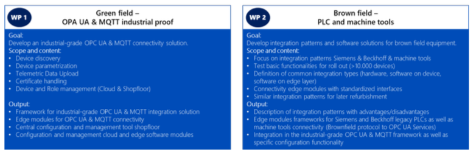
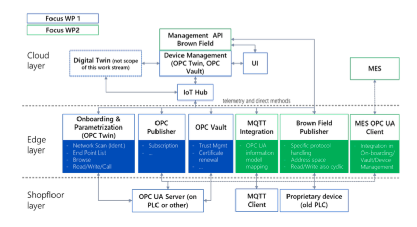

## IoT Connectivity Working Group Chapter

This Working Group Charter establishes the Scope and intellectual property terms used to develop the materials identified in this Working Group Charter for the Project. Only Project Steering Members, Associates, and Contributors that Joined the Working Group will be bound by its terms and be permitted to participate in this Working Group.

1. **Working Group Name**. **IoT Connectivity**
2. **Working Group Scope**. Some of the most common IIoT use cases for manufacturing are in the field of analytics. Examples are Overall Equipment Effectiveness (OEE) calculation and analysis, predictive maintenance for automation equipment or process data analysis to ensure process quality.

To enable such use cases, the connectivity of the automation equipment is the first step. The connection of new equipment which support modern standards like OPC UA Client/Server or the new OPC UA PubSub (based on MQTT) and brown field equipment, which often use proprietary protocols, can be difficult. Apart from the connectivity and some data collection, a simple and flexible framework to generate and deploy analytics models is the key enabler to get fast benefits from the solution but will not be part of this Working Group.

Both focus areas (green field & brown field) are not specific to a certain company but represent general challenges that have to be addressed by any manufacturing platform. In this Working Group, a generic edge-based layer to include OPC UA, MQTT as well as proprietary protocols is a requirement that must be met.

Therefore, the goal of this Working Group is to develop and define industrial-grade plug&play integration patterns for green- and brown-field equipment. To enable the integration patterns, matching software modules and services will be developed.

Industrial requirements like a common data model, telemetry data normalization and selection, firewalls policies, production network segmentation, security rules and regulations or monitoring and logging features to enable an industrial-grade application are often not considered in existing solutions which are therefore not complete for an industrial-grade scale. We will address them, though.

This Working Group is also an enabler for other Working Groups like cloud to cloud connectivity to use value added services of other vendors.

The work packages described in this document illustrate the main goals of this Working Group. The detailed content is not fixed and will be adjusted in an agile working model.

## Approach and Work Packages
For this Working Group, two work packages have been defined. Both address topics that are common to most manufacturing processes. The connectivity to green and brown field is the first key enabler for the IIoT solution. The analysis of the collected data is quite homogeneous in the field of manufacturing (mostly time series data from devices that must be correlated with reference data from other systems) and therefore can be addressed with a generic analytics framework. Figure 1 shows the defined work packages with their goals, scope, content and output.

3. **Copyright Policy**. Each Working Group must specify the copyright mode under which it will operate prior to initiating any work on any Draft Deliverable or Approved Deliverable other than source code. The copyright mode for this Working Group is: _**[Check one box]**_

     - [x] **Copyright Grant to Project**, as set forth in Appendix A, Copyright Policy Option 1.
     - [ ] **Creative Commons Attribution 4.0**, as set forth in Appendix A, Copyright Policy Option 2.

     - [ ] **Open Web Foundation 1.0.** (only for those Working Groups selecting the Open Web Foundation mode for patent licensing).
4. **Approved Deliverable Patent Licensing**. Each Working Group must specify the patent mode under which it will operate prior to initiating any work on any Draft Deliverable or Approved Deliverable other than source code. The patent mode for this Working Group is: _**[Check one box]**_

     - [x] **RAND Royalty-Free Mode**, as set forth in Appendix A, Patent Policy Option 1.
     - [ ] **International Mode**, as set forth in Appendix A, Patent Policy Option 2.
     - [ ] **Open Web Foundation Agreement 1.0 Mode**, as set forth in Appendix A, Patent Policy Option 3.
     - [ ] **W3C Mode**, as set forth in Appendix A, Patent Policy Option 4.
     - [ ] **No Patent License**. No patent licenses are granted for the Draft Deliverables or Approved Deliverables developed by this Working Group.

 The assurances provided in the selected patent mode are binding on the Working Group Participant’s successors-in-interest. In addition, each Working Group Participant will include in any documents transferring ownership of patents subject to the assurance provisions sufficient to ensure that the commitments in the assurance are binding on the transferee, and that the transferee will similarly include
appropriate provisions in the event of future transfers with the goal of binding each successor-in-interest.

5. **Source Code**. Working Group Participants contributing source code to this Working Group agree that those source code contributions are subject to the Developer Certificate of Origin version 1.1, available at http://developercertificate.org/, and the license indicated below. Source code may not be a required element of an Approved Deliverable specification. _**[Check one box]**_
     - [ ] **Apache 2.0**, available at http://www.apache.org/licenses/LICENSE-2.0.html. 
      - [x] **MIT License**, available at https://opensource.org/licenses/MIT.
     - [ ] **Mozilla Public License 2.0**, available at https://www.mozilla.org/MPL/2.0/. 
     - [ ] Other_________________________________
     - [ ] No source code will be developed.

6. **Non-Working Group Participant Feedback and Participation**. Upon the Approval of the Working Group Participants, the Working Group can request feedback from and/or allow Non-Working Group Participant participation in a Working Group, subject to each Non-Working Group Participant executing the Feedback Agreement set forth in **Appendix B**.